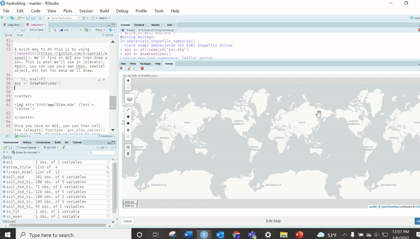
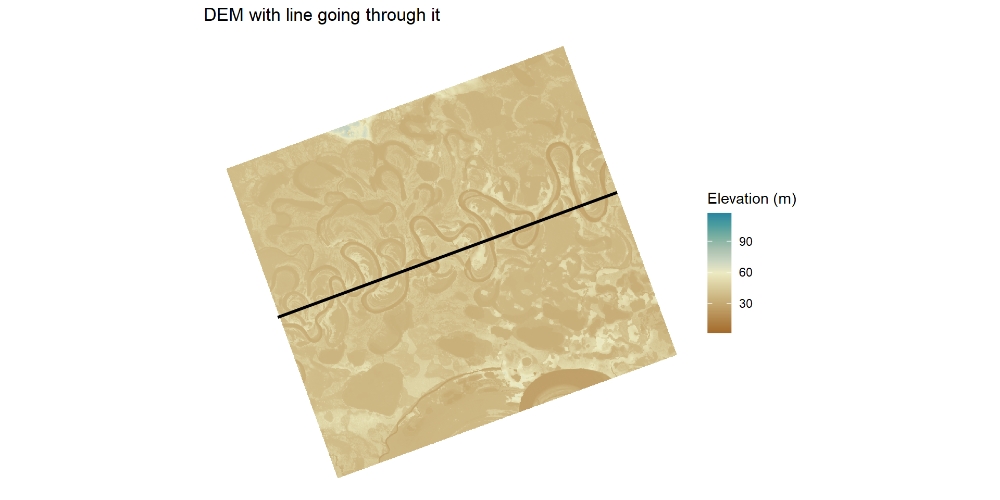
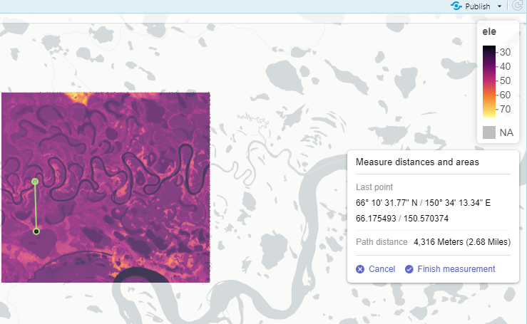
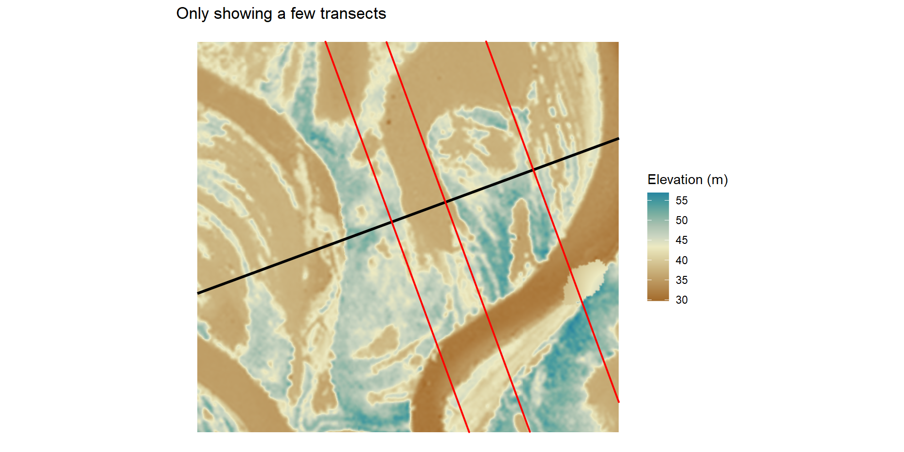
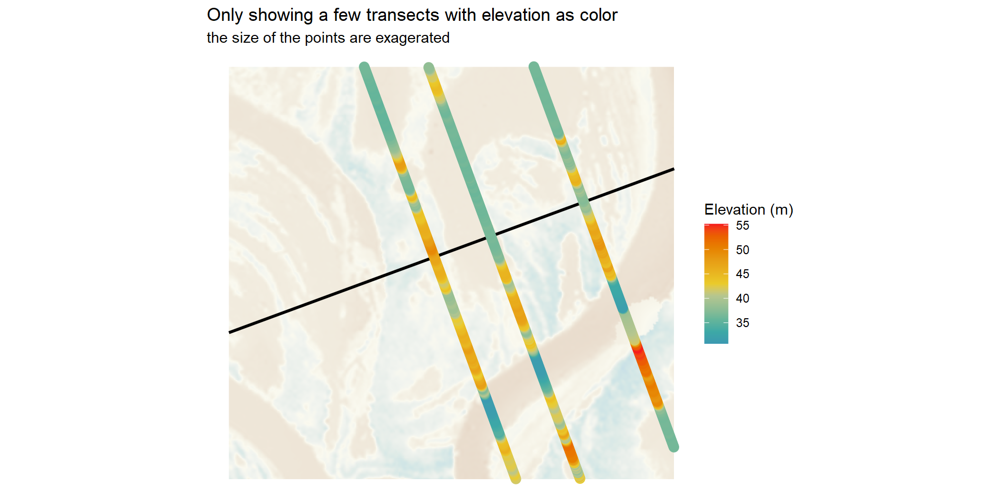
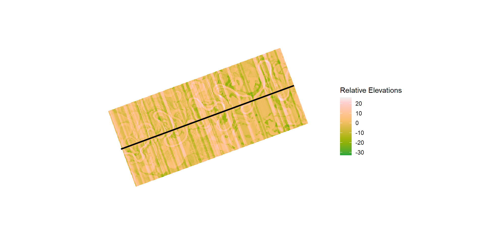
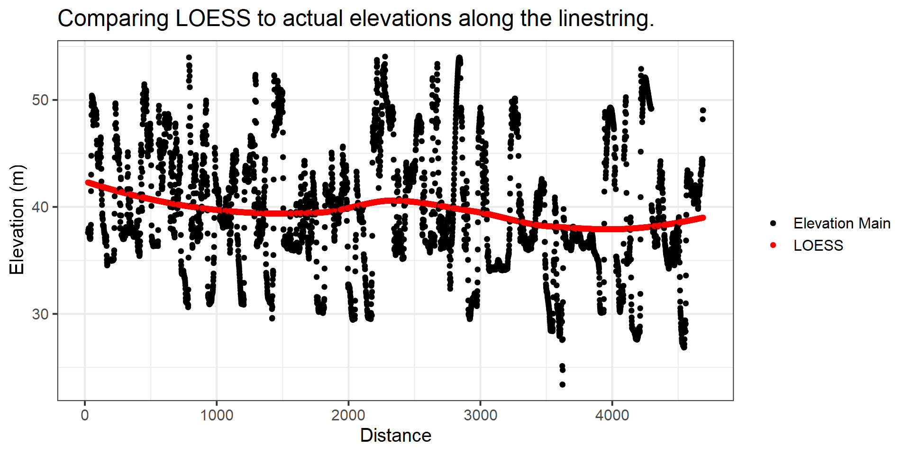
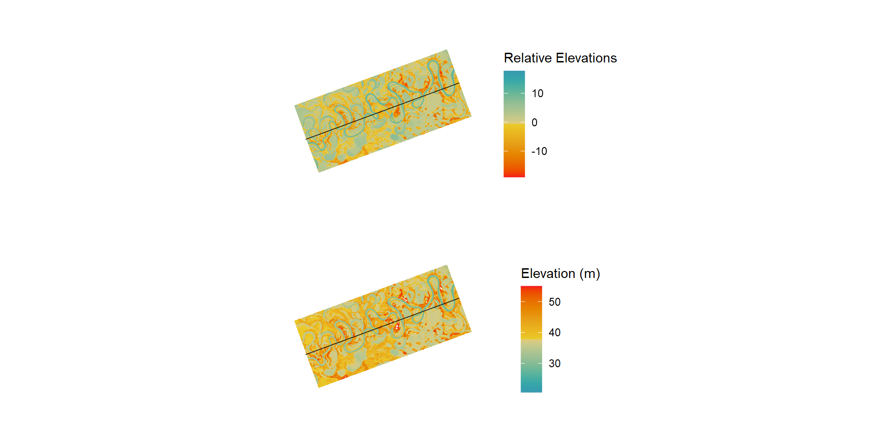
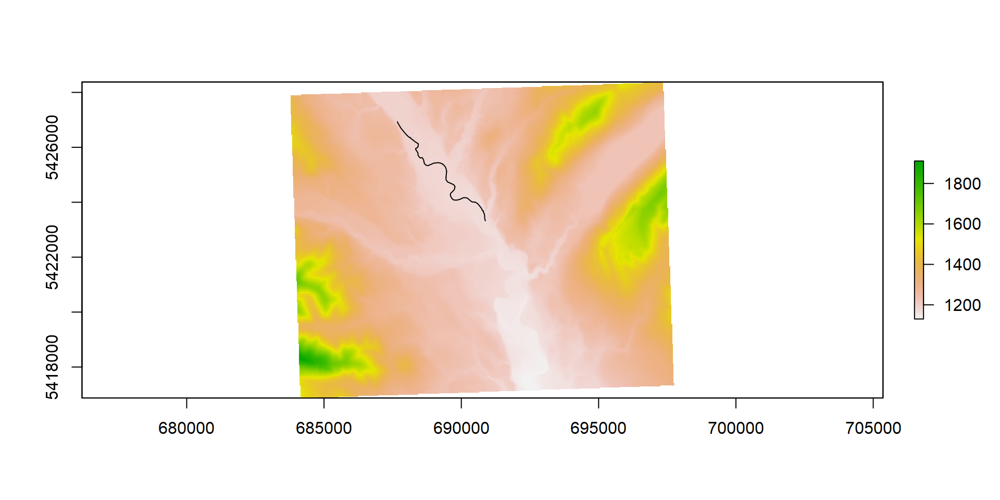
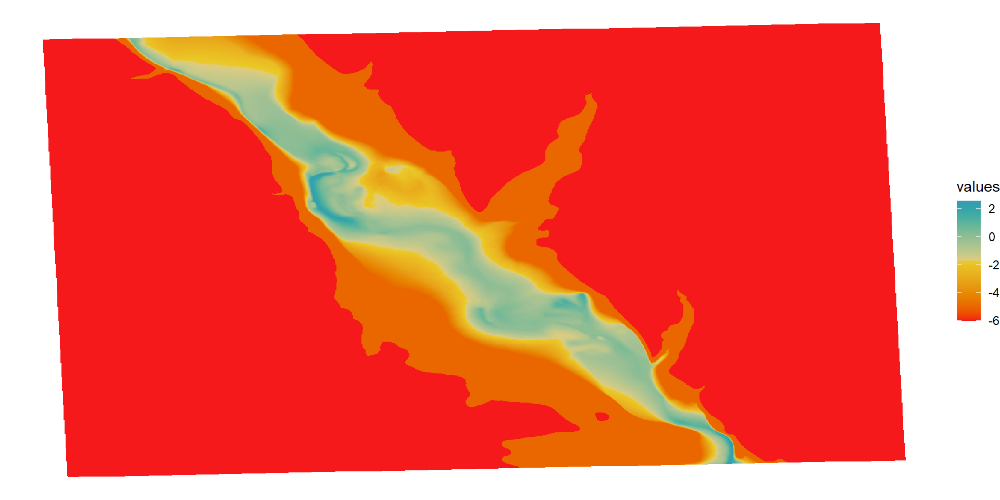

```{r, message=FALSE, warning=FALSE, error = F, include=F}
knitr::opts_chunk$set(dev.args = list(png = list(type = "cairo")),fig.width = 10, fig.height = 5,
                      warning = FALSE, message = FALSE, error = FALSE)


```

## Introduction

I wanted to do a quick dive into the [{remr}](https://github.com/joshualerickson/remr) and show how to create Relative Elevation Models (REM) relatively easy in R. You might be asking, 'what the heck is a REM?' An REM is a way to get elevations relative to a specific elevation. For example, you might want to see whether elevations further away from a point are relatively lower or higher. One way to do this is create transects (linestrings) at a certain angle from the point of interest (cross-section method) or use an interpolation method (IDW, KNN, etc) to relate elevations. This can help with river restoration and design ([Powers et al. 2019](https://onlinelibrary.wiley.com/doi/pdf/10.1002/rra.3378)), flood prone areas and research, and of course fun art stuff `r emo::ji('laugh')`. Highly recommended, Dan Coe has some great tutorials on REM in QGIS with step by step instructions, find [here](https://dancoecarto.com/tutorials).

## DEM  

A big part of a REM is the elevation grid. There are plenty of ways to get elevation grids in R but for reproducibility I'm going to use the [{elevatr}](https://github.com/jhollist/elevatr). We need to find an AOI (area of interest) and then we can call the `get_elev_raster()` function.  

```{r, messages = F, warning=F, error=F}
#load libraries we'll need
library(terra)
library(elevatr)
library(remr)
library(sf)
library(mapedit)
library(mapview)
library(leaflet)
library(stars)
library(gstat)
library(tidyverse)
```

A quick way to do this is by using [{mapedit}](https://github.com/r-spatial/mapedit). We'll find an AOI and then draw a box. This is what we'll use in {elevatr}. Again, you can use your own bbox, spatial object, etc but for ease we'll draw. 

```{r, eval=F}
aoi <- drawFeatures()
```
<br>
<center>


</center>
<br>

Once you have an AOI, you can then call the {elevatr} function `get_elev_raster()` to get a DEM. To make it easier to work with an REM we'll need to convert our raster to meters projection instead of degrees. Also, the `z` argument is indicative of the zoom (higher meaning better resolution) and `clip` helps decide how to clip the DEM.  

```{r, eval = F}
# convert aoi to utm proj.
aoi_proj <- aoi %>% st_transform(crs = '+proj=utm +zone=52 +datum=WGS84 +units=m +no_defs')

# get elevation raster (DEM) with utm proj.
ele <- get_elev_raster(locations = aoi_proj,
                       z = 13,
                       prj = '+proj=utm +zone=52 +datum=WGS84 +units=m +no_defs',
                       clip = 'bbox')

```

Now that we have a DEM we need to figure out what points we want to relate to. When using {remr}, the function needs a linestring. Why linestring? Well, it's easier to create a final grid (REM) but essentially it creates points along the linestring, so... you could technically use points (maybe in a future release). I like to use one straight linestring (like below) but you could also use multiple linestrings (you would need to run lapply() or map() though on each feature). So let's draw a linestring on our DEM.  

```{r, eval=F}

line_aoi <- mapview(ele)@map %>%     
            drawFeatures() %>% 
            st_transform('+proj=utm +zone=52 +datum=WGS84 +units=m +no_defs')
  

```

Ok, before we go on let's look at what we have.  

```{r, eval = F, messages = F, warning = F, echo = F}

```

We have a DEM and a line that goes through it.Pretty simple, right? From here we want to see what the adjacent elevation is __relative__ to the line. This is where we'll use the {remr}.  

## remr  

At a bare minimum, we need to provide a DEM and a line. We also need to know the split on the line (`distance`) and the length of the transects (`length`). This is a __cross-section__ method and right now is the current method in {remr}. The split will typically be the resolution of the raster input. You can use the code below to get an idea of a distance by using {leafextras} and {maview/leaflet} to get a measurement.  

```{r, eval=F}
mapview(list(ele, line_aoi))@map %>% 
  leaflet.extras::addMeasurePathToolbar()
```
<center>
```{r, echo = F}

```
</center>

:::{.b--red .ba .bw2 .ma2 .pa4 .shadow-1}

This can take a while depending on resolution and size! Also, it's a memory eater as well... I'd like to have an option to write to disk in the future but for now just be aware.

:::

Running the `get_rem()`.  

```{r, eval = F}

rem <- get_rem(linestring = line_aoi,
               raster = ele,
               distance = raster::res(ele)[[1]]],
               length = 4000)
```

The function is getting elevations at each point along the linestring (`line_aoi`) at a distance as well as along a transect at a 90 degree angle. This gives a grid of points and elevations. Here is a close up below. I just took some random transects to show how it's oriented across the linestring but essentially there is one every _distance_ of the input (it would look like a blur if I showed all).   

```{r, eval = F, echo=F}

rem_sub <- rem %>% filter(group %in% c(489, 550, 650))
crop_dem <- st_set_crs(crop_dem, '+proj=utm +zone=52 +datum=WGS84 +units=m +no_defs')
cdem <- raster::crop(ele, crop_dem)
cline <- st_crop(line_aoi, crop_dem)
ctran <- st_crop(rem_sub, crop_dem)

ggplot() + 
  geom_stars(data = st_as_stars(cdem)) +
  scale_fill_gradientn(colors = hcl.colors('Earth', n = 11), na.value = NA)+
  geom_sf(data = cline, size = 1) +
  geom_sf(data = ctran, size = .05, color = 'red') +
  theme_void() +
  labs(fill = 'Elevation (m)', title = "Only showing a few transects")


```

```{r, messages = F, warning = F, echo = F}

```
We can also see that each point has an elevation associated with it (see below). We now need to subtract these elevations from the main elevation (linestring).

```{r, messages = F, warning = F, echo = F}

```

This will give us a __relative__ elevation!  

```{r, eval = F}
rem$rem <- rem$elevation_main - rem$elevation_adj

rem_rast <- terra::rasterize(terra::vect(rem), terra::rast(ele), 
        field = "rem")

rem_rast <- terra::focal(rem_rast, fun = 'mean', window = 3, na.policy = 'only', na.rm = TRUE )

```

This will give us a grid of elevations related to the main linestring. Some will be lower (positive) and some higher (negative). This gives us a good idea of where water could theoretically pop up (gaining groundwater reach or overflow surface water). This really helps with visualizing floodplains prior to field observations.  

```{r, messages = F, warning = F, echo = F}

```

But wait. How is this helpful? It just tells us information from the line? Wouldn't it be better to just do it along the stream. For sure. Along a stream would be better but it would also overlap (can be done with a consistent angle, i.e. not at 90 for every point). This is where you can take a __regression of choice__ and use that instead as your elevation main. So below we'll use a LOESS function to predict the elevation. What this does is give an arbitrary value to relate to, which will make it easier to see and use for understanding adjacent areas. 

```{r, eval = F}

rem_loess <- rem %>% 
  st_drop_geometry() %>% 
  group_by(group) %>% 
  slice(n = 1) %>% 
  na.omit() %>%
  ungroup() %>% 
  mutate(loess = as.numeric(predict(loess(elevation_main~group, data = .)))) %>% select(loess, group) %>% right_join(rem, by = 'group')

```

```{r,  messages = F, warning = F, echo = F}

```

Now we can redo the the REM with LOESS as our main elevation.  

```{r, eval = F}
rem_loess$rem_loess <- rem_loess$loess - rem_loess$elevation_adj

rem_rast_loess <- terra::rasterize(terra::vect(rem_loess), terra::rast(ele), field = "rem_loess")

rem_rast_loess <- terra::focal(rem_rast_loess, fun = 'mean', window = 3, na.policy = 'only', na.rm = TRUE )

```

Now let's look at the REM. Ahhh, much better! You can see that when you compare side-by-side it's not too much of a difference; however, the farther up river you go the more the elevation increases and will make it difficult to see. With a REM, this isn't the case since it's always relating to the line!  

```{r, messages = F, warning = F, echo = F}

```


## So what?  

Totally agree. So what, right? We could just use the DEM grid to interpret and check. Yes. There are a lot of different ways to add a _relative_ (the relation you want) linestring. For example, you could collect bankfull heights in the field, terrace heights, thalweg, etc. The REM then relates back to these elevations and gives you an idea of height above or below. With the DEM approach, you are always having to do the math on the fly!  

## Interpolation  

Another approach is the interpolation method, which as you can imagine '__interpolates__' the elevations near a line. This is great for stream segments in the [{nhdplusTools}](https://github.com/USGS-R/nhdplusTools) because of the overlapping that would occur if we used the transect method. Below we'll look at a stream in the USA (NFK Flathead River) and apply the interpolation method.  

* Get DEM  
* Get Stream Segment
* Interpolate  
* Subtraction

#### DEM  

Again we'll use the {elevatr} package to get the DEM as well as use a meters projection. 

```{r, eval=F}
aoi2 <- drawFeatures()
```

```{r, eval = F}
# convert aoi to utm proj.
aoi2_proj <- aoi2 %>% st_transform(crs = '+proj=utm +zone=11 +datum=WGS84 +units=m +no_defs')

# get elevation raster (DEM) with utm proj.
ele2 <- get_elev_raster(locations = aoi2_proj,
                       z = 13,
                       prj = '+proj=utm +zone=11 +datum=WGS84 +units=m +no_defs',
                       clip = 'bbox')

```

Get the stream segment using [{gwavr}](https://github.com/joshualerickson/gwavr) package.  

```{r, eval=F}
library(gwavr)

nhd <- get_nldi_interactively() 

nhd_crop <- nhd[[1]]$UM %>% 
            st_transform('+proj=utm +zone=11 +datum=WGS84 +units=m +no_defs') %>% 
  st_crop(aoi2_proj)

```

```{r, messages = F, warning = F, echo = F}

```

Now we can use the `st_line_sample()` in {sf} to get points along the river.  

```{r, eval = F}
points_along_river <- nhd_crop %>% st_cast(.,'LINESTRING') %>% 
  st_line_sample(., density = terra::res(ele2)[[1]]) %>%    st_as_sf()

```

From here, we just choose a __interpolator of choice__! We'll use IDW from the {gstat} package. We'll extract the elevation from each point and then use that to interpolate onto the elevation grid.  

```{r, eval = F}

points_along_river <- points_along_river %>% st_cast('POINT') %>% st_as_sf() %>% rename(geometry = 'x') 

points_along_river$ele <- terra::extract(terra::rast(ele2), terra::vect(points_along_river))[,2] 

points_along_river <- points_along_river %>% na.omit()

setup_points <- gstat(formula=ele~1, id = 'ele', data=points_along_river)

## from terra issue 208
fg <- function(model, x, crs, ...) {
     v <- st_as_sf(x, coords=c("x", "y"), crs=crs)
     p <- predict(model, v, ...)
     # right now you need to cbind the coordinates; that I can fix
     cbind(x, as.data.frame(p)[,1:2])
}

idw <- terra::interpolate(ele2, setup_points, fun = fg, crs = '+proj=utm +zone=11 +datum=WGS84 +units=m +no_defs', na.rm = T)
```

Finally, we'll just subtract the OG elevation grid from then new interpolated grid to get the REM!  

```{r, eval=F}
idwr <- idw-ele2
```
```{r,  messages = F, warning = F, echo = F}

```

## Conclusion  

As you can see there are a couple different ways to do this as well as different ways to apply. I typically just use it to see the confinement of a floodplain and valley. Alright, alright. Mostly just for art :) Hope this helps! Have fun with REMs!

## References  

Powers, P. D., Helstab, M., & Niezgoda, S. L. (2019). A process‐based approach to restoring depositional river valleys to Stage 0, an anastomosing channel network. River Research and Applications, 35(1), 3-13.


