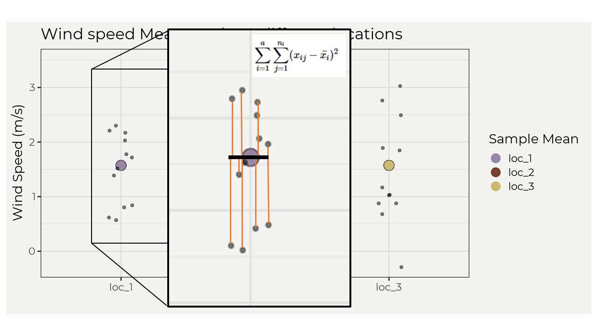

```{r,include=F}
knitr::opts_chunk$set(dev.args = list(png = list(type = "cairo")),fig.width = 10, fig.height = 5,
                      warning = FALSE, message = FALSE, error = FALSE)
thematic::thematic_rmd(font = 'Montserrat', bg = '#f2f2f1', fg = '#000000')
ggplot2::theme_set(ggplot2::theme_bw(base_size = 16))
```

## Intro

In this blog post we will dive into ANOVA aka Analysis of Variance and see how we derive the final output from a function like `anova()` by using packages like {tidyverse}. ANOVA is a OG when it comes to statistics and comparing multiple groups of data. It can seem weird at first but since it goes hand-in-hand with regression I think it makes it less scary. In this blog post we will go over one-way ANOVA. We want to start with some groups of data like wind-speed at multiple stations or mean annual flows for August at multiple gauging stations. Once we have this we can start performing ANOVA.  

## EDA  

Let's bring in some data and explore! This data is from three different weather stations and the random variable is wind speed. This is a perfect time to use the `tribble()` from which we can create a tibble. We'll also pivot the locations so that we can use for plotting and grouping.  

```{r}
library(tidyverse)
wind_speed <- tribble(
  ~loc_1, ~loc_2, ~loc_3, ~month,
  2.21,0.87,1.89, 1,
  0.62, 1.65, 3.03, 2,
  2.03, 0.74, 1.85, 3,
  0.8, 3.52, -0.29, 4,
  0.84, 2.27, 0.68, 5,
  1.52, 2.15, 2.76, 6,
  0.57, 1.33, 1.03, 7,
  1.39, 1.87, 0.88, 8,
  2.3, 1.93, 1.03, 9,
  1.78, 2.48, 2.49, 10,
  2.17, 1.44, 0.88, 11,
  1.72, 1.03, 1.17, 12
)

wind_speed_piv <- wind_speed %>% pivot_longer(cols = contains('loc'))
```

Now if we plot these groups out we can see visually what they look like together.  

```{r, echo=F}
wind_speed_piv %>% 
  ggplot(aes(name, value)) + 
  geom_boxplot() +
  labs(y = 'Wind Speed (m/s)', x = 'Locations', title = 'Boxplots of wind speed at three different locations')
```

I mean they seem similar? This is where the eye-ball test fails big time (even for seemingly different boxplots i.e. 95% CI don't overlap). Welcome ANOVA. ANOVA comes in and helps us determine if any of these groups are different at some threshold. In this example we'll set the threshold to the OG 0.05 thresh. Remember, a p value is the probability of showing a difference equal to or more extreme than what we have observed! This means that we will be surprised if it is less than 0.05 but not so much surprised if it's 0.5. But first, let's make a better plot to also show the distribution of these groups alongside the boxplots.


```{r, echo = FALSE}
ggplot(wind_speed_piv, aes(x = name, y = value)) + 
  ggdist::stat_halfeye(
    adjust = .5, 
    width = .6, 
    .width = 0, 
    justification = -.3, 
    point_colour = NA, aes(fill = name)) + 
  geom_boxplot(
    width = .25, 
    outlier.shape = NA,
    aes(color = name)
  ) +
  geom_point(
    size = 3.3,
    alpha = .83,
    position = position_jitter(
      seed = 1, width = .1
    ), aes(color = name)
  ) + 
  scale_color_manual(values = wesanderson::wes_palette('IsleofDogs1')) +
  scale_fill_manual(values = wesanderson::wes_palette('IsleofDogs1')) +
  coord_cartesian(xlim = c(1.2, NA), clip = "off") +
  labs(y = 'Wind Speed (m/s)', x = 'Locations', title = 'Raincloud plots of wind speed at three different locations') + theme(legend.position = 'none')
```

Ok, this looks much better (IMO) and more intuitive! Now I'm unsure if there isn't a difference `r emo::ji('smile')`. Why don't we just find out and see. Like, just take the function `anova()` and see? Well, what fun would that be! Let's keep the suspense going...  

## Assumptions

There are some assumptions when performing ANOVA that are very similar to regression `r emo::ji('wink')`. 

* Normality within the groups distribution.
* Independent and identically distributed (iid) assumption.
* Groups of similar variance.  

To do this we'll test these assumptions with a few functions in the stats package. For normality, we'll use the `shapiro.test()` to test for normality with a 0.05 threshold. For iid, we'll assume that the stations are far enough away from each other so that they are not spatially autocorrelated and we'll assume the measurements are the same protocol. For variance, we'll use Bartlett's test `bartlett.test` for similar variance across groups since the groups are normally distributed. 

#### Results  

We are looking for all the p values to be above 0.05. If so, then we can move on in this example. If not, then we would need to do some data transformations or some different test.

```{r, echo=F}
shap <- wind_speed_piv %>% 
  group_by(name) %>% 
  nest() %>% 
  mutate(model = map(data, ~shapiro.test(.$value)),
      tidy = map(model, broom::tidy)) %>% 
  unnest(tidy) %>% select(name, p.value, method) 

bart <- bartlett.test(wind_speed_piv$value, wind_speed_piv$name) %>% 
      broom::tidy() %>% mutate(name = 'all groups') %>% 
  select(name, p.value, method) 

shap %>% 
  bind_rows(bart) %>% 
  kableExtra::kable() %>% 
  kableExtra::kable_styling()
```


In our case it looks like we are fine to move on and perform ANOVA! Remember this is a toy example and in the 'real world' it is likely to not be so cookie-cutter but that's fine! Don't get shook! There are plenty of ways to correct for this, e.g. transformations, different tests (allow for non-parametric data), etc.  

## ANOVA  

So to perform ANOVA we need to step back and remember what we are trying to find, 'are there differences (variance) between these groups?'. To do that it would make sense to take the means of each group and the standard deviation and see how different they are right? Well let's do that. 

```{r, echo=F}
wind_speed_piv %>% 
  group_by(name) %>% 
  mutate(sd = sd(value)) %>% 
  ungroup() %>% 
  ggplot(aes(name, y = mean(value))) + 
  geom_point(size = 5.5, fill = 'black') +
  geom_point(size = 5, aes(color = name))+ 
  geom_errorbar(aes(ymin = mean(value)-sd, ymax = mean(value) + sd), lwd = 1, width = .25) +
  geom_jitter(aes(y = value), alpha = 0.5, width = .1) +
  scale_color_manual(values = wesanderson::wes_palette('IsleofDogs1')) +
  labs(y = 'Wind Speed (m/s)', x = 'Locations', title = 'Wind speed Means at three different locations', color = 'Sample Mean') 
```

Well, looks like there really isn't any difference! But what does that look like mathematically? That is say, what the heck is ANOVA trying to do? Because sometimes it's not as easy as the toy example we are looking at and we will eventually need to understand how to do it mathematically or report it instead of saying 'well it looks the same'. Well ANOVA wants to take the groups and see if there variance is equal to each other, right? To do that, it needs to find out the variance due to attributes (SSA) and the variance due to random error (SSE). There has to be something with *variance*, right? I mean it is named analysis of **variance**... So, mathematically it can be expressed in the formula below where SST is the total sum of squares,

$$
\text{SST} = \text{SSA} + \text{SSE} \\ 
\sum_{i=1}^{a}\sum_{j=i}^{n_i}(x_{ij}-\mu)^2=\sum_{i=1}^{a}\sum_{j=1}^{n_i}(\bar{x_i}-\mu)^2+\sum_{i=1}^{a}\sum_{j=1}^{n_i}(x_{ij}-\bar{x_i})^2
$$  

This looks really familiar, no? That's because the parts are really similar to regression methods, e.g. the total sum of squares $TSS = \sum_{i=1}^{n}(y_{i}-\bar{y})^2$. Remember we wanted to find out "the variance due to attributes (SSA) and the variance due to random error (SSE)" and that results in the total sum of squares for the samples. If there is a group that has more variance than the others attribute error (SSA) we should then pick that up when we compare it to the random error (SSE). Another way to think about this is graphically. Let's look at the SSE in a graph. The image below shows the $\sum_{j=1}^{n_i}(x_{ij}-\bar{x_i})^2$ part of the equation, which shows the residuals (red lines) and then squaring and summing; however, we do this for each group and then sum! That then gives us the sum of squared errors SSE.

```{r, echo = F}


```

To calculate the SSA we just take the mean of each group minus the overall mean then square and sum. But, we then multiply by the number of points for **one** group. So in our example it would be $12*\sum_{j=1}^{n_i}(\bar{x_i}-\mu)^2$. Ok, so how can we interpret all of this? For me, if a group is further away from the overall mean then it will increase SSA and thus influence the overall variance but might not always increase random error! This is important because the next step in ANOVA is to solve for the mean square error (MSE) and the mean square attribute (MSA), which involve ratios and can be sensitive to increases in one variable, e.g. SSA. This is the whole point of ANOVA; figure out if there is more attribute error within the group compared to the groups random error. In the equation below $N$ is equal to the number of observations and $a$ is equal to the number of attributes/groups. In our case, $N=33$ & $a=3$. 

$$
\text{MSE} = \frac{SSE}{N-a} \ \ \ \ \ \ \ \ \ \ \ \ \ \ \ \ \ \ 
\text{MSA} = \frac{SSA}{a-1}
$$


Once we have these solved we can find the F statistic (from which we'll get the p value) by taking the ratio of $MSE$ and $MSA$, e.g. $F=\frac{MSA}{MSE}$. If our F statistic is less than the critical value F statistic for a $\alpha = 0.05$ than we cannot reject the null hypothesis!  

## Finally 

Ok, so we took a long time to get here but now we'll actually go ahead and solve it with our data step-by-step.  

We'll need the overall mean and the mean of each group.
```{r}
overall_mean <- wind_speed_piv %>% 
  summarise(overall_mean = mean(value))

mean_of_each <- wind_speed_piv %>% 
  group_by(name) %>% summarise(mean_of_each = mean(value)) %>% ungroup
```

Now we need to solve for SSA and SSE.

```{r}
ssa <- wind_speed_piv %>% mutate(overall_mean = overall_mean) %>% 
  left_join(mean_of_each, by = 'name') %>% 
  group_by(name)  %>% slice_head(n = 1) %>% ungroup() %>% 
  summarise(ssa = 12*sum((mean_of_each - overall_mean)^2))

sse <- wind_speed_piv %>% mutate(overall_mean = overall_mean) %>% 
  left_join(mean_of_each, by = 'name') %>% 
  group_by(name) %>% summarise(sse = sum((value - mean_of_each)^2)) %>% 
  pull(sse) %>% sum()
```

Now we can solve for the MSA and MSE and thus the F statistic!

```{r}

MSA = ssa/2
MSE = sse/33

f = MSA/MSE
```

Our final F statistic is `r round(f, 4)`. If $F<F_{(0.05)}(2,33)$ then we cannot reject the null hypothesis. $F_{(0.05)}(2,33)=3.284$ which means $F<F_{(0.05)}(2,33)$ is true and we cannot reject the null! There is no statistical difference between groups at a 0.05 threshold! You can use the `qf()` to find the F critical value, e.g. `qf(0.95,2,33)`.

## Smart easy way

The smart easy way, which is the way you will always do it most likely, is to take the linear model of the data and then use the `anova()`. We'll use this method and compare to what we got above.  

```{r}
model <- lm(value~name, data = wind_speed_piv)

anova(model)

```

Voila, the same! The F value is the same as above and the p value is greater than 0.05 so we cannot reject the null!  

## Conclusions

Hopefully this helps with understanding ANOVA! I try to look at it by how certain variables are more sensitive than others (SSA) as well as the similarities to regression, e.g. explaining the variance in the data. If you have any comments, concerns or questions please let me know. Thanks.
