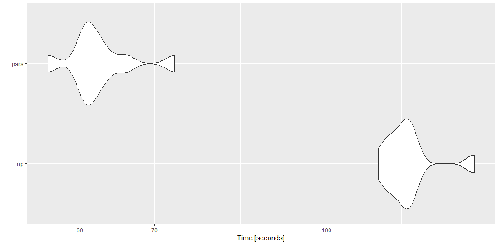

```{r,include=F}
knitr::opts_chunk$set(dev.args = list(png = list(type = "cairo")),fig.width = 10, fig.height = 5,
                      warning = FALSE, message = FALSE, error = FALSE)
thematic::thematic_rmd(font = 'Montserrat', bg = '#f2f2f1', fg = '#000000')
ggplot2::theme_set(ggplot2::theme_bw(base_size = 16))
library(wildlandhydRo)
library(microbenchmark)
library(dataRetrieval)
library(tidyverse)
```

# Intro  

The goal of wildlandhydRo is to create wrapper functions around commonly used packages like [streamstats](https://github.com/markwh/streamstats), [snotelr](https://github.com/bluegreen-labs/snotelr) and [dataRetrieval](https://github.com/USGS-R/dataRetrieval) and prepare them for chunk-based parallelism, data munging and reporting. Basically, a package for me but worth sharing with others.

## Installation

You can install the development version from [GitHub](https://github.com/) with:

``` r
# install.packages("devtools")
devtools::install_github("joshualerickson/wildlandhydRo")
```
## Examples

Below are some common examples that I routinely use with the package.

### Parallel

With {wildlandhydRo} it is really easy to get station data in parallel. The functions use the [{furrr}](https://github.com/DavisVaughan/furrr) framework and will work by planning a session prior to calling the function. Below is a quick benchmark between the options; regular (np) or parallel (para).  

```{r example, message=FALSE, error=FALSE, warning=FALSE, eval=F}
library(wildlandhydRo)
library(microbenchmark)
library(dataRetrieval)

sites <- dataRetrieval::whatNWISsites(stateCd='MT', parameterCd = '00060') %>% 
  filter(nchar(site_no) <= 8)

tm <- microbenchmark(
 'np' = {
   batch_USGSdv(sites = sites[1:50,]$site_no, parallel = FALSE)},
 'para' = {
   future::plan('multisession')
   batch_USGSdv(sites = sites[1:50,]$site_no, parallel = TRUE)},
 times = 10
)

tm

autoplot(tm)
```

```{r, echo=FALSE,out.width = '100%', out.height = '100%'}

```

You can do this for most functions in the package, e.g. `batch_*(), wym*(), ym*(), get_Basin()`, etc.  

### Annual and Monthly Stats  

With the package you can get monthly, annual and monthly-annual statistics for a snotel or usgs sites. You can provide a previously create `batch_*()` data.frame or the station id. This creates/mungs the results of the daily values  to generate mean, maximum, median and standard deviation per water year or per water year per month. It also includes peaks from dataRetrieval::readNWISpeak(); annual base-flow (tp = 0.9, window = 5) and Base-flow Index (BFI) (total-flow/base-flow) from baseflow; annual coefficient of variance (sd of flow/mean of flow); and normalization methods Flow/drainage area, Flow/(all time mean flow) and Flow/log(standard deviation). The window for all the methods are annual, e.g. 1. This leaves it up to the user to explore different windows if inclined. Monthly stats 

```{r}
water_year <- wyUSGS(sites = '12304500')
ggplot(water_year, aes(peak_dt, Peak)) + 
  geom_line() +
  labs(title = 'Peak Flow per Water Year', 
       subtitle = paste0(water_year %>% slice(n=1) %>% .$Station))

monthly <- wymUSGS(sites = '12304500')
ggplot(monthly, aes(year_month, coef_var)) +
  geom_line() +
  labs(title = 'Monthly Coefficient of Variance', 
       subtitle = paste0(monthly %>% slice(n=1) %>% .$Station))


```

### Get Percentiles for Reporting  

You can also just generate percentiles for daily values or months.   

* Daily  

```{r}
yaak_dv <- batch_USGSdv(sites = '12304500')

usgs_rep <- reportUSGSdv(procDV = yaak_dv, days = 60)

plot_reportUSGS(usgs_rep)

```

* Monthly  

```{r}

usgs_rep_month <- reportUSGSmv(procDV = yaak_dv)

plot_reportUSGS(usgs_rep_month %>% filter(year_nu >2020), time = 'month')
```

### Get a Drain Point  

Sometimes you just want to get the drainage area above a point and then do some other things. With `get_Basin()` function you just have to provide a sf point and it will return the basin. If you want zonal stats associated with that drainage area then just use `get_BasinStats()`.  

* Basin

```{r}
pt <- tibble(lon = -114.36, lat = 48.92)
pt <- sf::st_as_sf(pt, coords = c('lon', 'lat'))

basin <- get_Basin(pt)

ggplot() + geom_sf(data = basin)
```

* Basin Stats  

```{r, fig.width = 10, fig.height = 10}

basin_stats <- get_BasinStats(basin)

basin_stats %>% sf::st_drop_geometry() %>% 
  pivot_longer(cols = c('TOT_PET', 'TOT_BFI', 'TOT_TWI')) %>% 
  select(name, value, comid) %>% 
  right_join(basin_stats, by ='comid') %>% sf::st_as_sf() %>% 
  ggplot() + 
  geom_sf(aes(fill = value)) +
    facet_wrap(~name, nrow = 3) + theme_void()
```


