<style>
@import url('https://fonts.googleapis.com/css2?family=Gochi+Hand&family=Handlee&display=swap');
</style>

```{r setup, include=FALSE}
options(htmltools.dir.version = FALSE)
knitr::opts_chunk$set(
  fig.width=9,
  fig.height=3.5,
  fig.retina=3,
  out.width = "100%",
  cache = FALSE,
  echo = TRUE,
  message = FALSE, 
  warning = FALSE,
  fig.show = TRUE,
  hiline = TRUE
)
```

```{r xaringan-logo, echo=FALSE}
xaringanExtra::use_logo(
  image_url = "hydro_code_files/images/usda_usfs.png",
  position = xaringanExtra::css_position(top = NULL, bottom = '-2em')
)
```

```{r xaringanExtra, echo=FALSE}
xaringanExtra::use_xaringan_extra(c("tile_view", "tachyons", "scribble", 'share_again', 'animate_css', 'panelset'))
xaringanExtra::use_progress_bar(color = "#0051BA", location = "bottom")
xaringanExtra::use_freezeframe()
```
```{r xaringan-extra-styles, echo=F}
xaringanExtra::use_extra_styles(
  hover_code_line = TRUE,         #<<
  mute_unhighlighted_code = TRUE  #<<
)
```
```{r xaringan-animate-all, echo=FALSE}
xaringanExtra::use_animate_all(c("fade"))
```


## What is Coding?

--

- Coding is a way to communicate with computers through computer programming languages.  `r emo::ji('zero')`'s and `r emo::ji('one')`'s  

--

.body-gif[]

--

- examples include;

--

  - Python  
  
--

  - R    
  
--

  - JavaScript  (JS) 
  
--

  - , , Rust , Fortran , etc. 
  
--

- In our domain; most likely going to use (Python, R, JS).

--

---

.center-warning[Warning]

.center-text[We will look at code!]

---


---


---
<center>
<br>
.ff-big[Automation]
<br>
<br>
.ff-big[Scalability]
<br>
<br>
.ff-big[One stop shop]
<br>
<br>
.ff-big[Reproducibility]
</center>

---
<br>
<br>
<br>
<br>


---

.ff-mid[Plus I'll share some links; how to get started.]


---

## Outline  

--

- Go over .blue[automating] some tasks like getting USGS gage data.

--

- How to .blue[scale] an idea with coding.

--

- .blue[One stop shop] -- do spatial analysis.

--

- .blue[Reproducibility].

--

- Where to get started!

---

## Automation  

--

- Let's explore some .blue[peak flows] at USGS gauging stations; visually.

--

- And then do a flood frequency analysis.

--


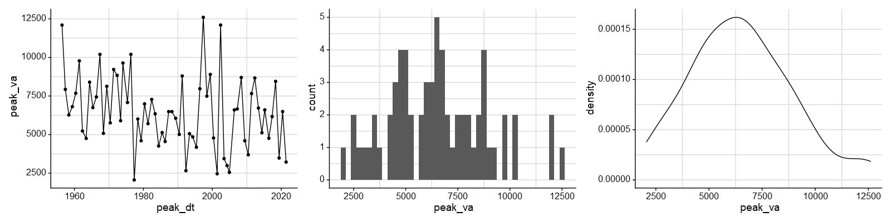
  
---
## Getting the data with coding

--

With coding it's as simple as loading a few libraries and then calling some functions.

--

```{r, eval=F}
library(tidyverse)
library(ggtext)
library(whitewater)

# get peak flow data
peak_yaak <- ww_wyUSGS(sites = 12304500)

# graph data
ggplot(peak_yaak, aes(peak_dt, peak_va)) + 
  geom_point() + 
  geom_line() +
  scale_y_continuous(labels = scales::comma_format()) + 
  geom_smooth(method = 'lm', alpha = 0.15) 
```

--
---

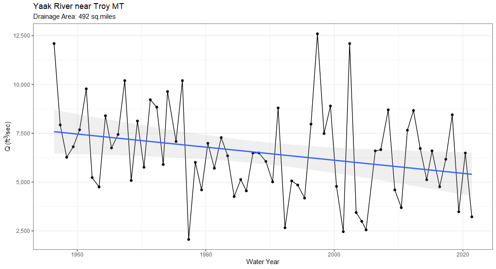

--

---

## Flood Frequency  

--

What's nice about coding is there are plenty of options!  

--

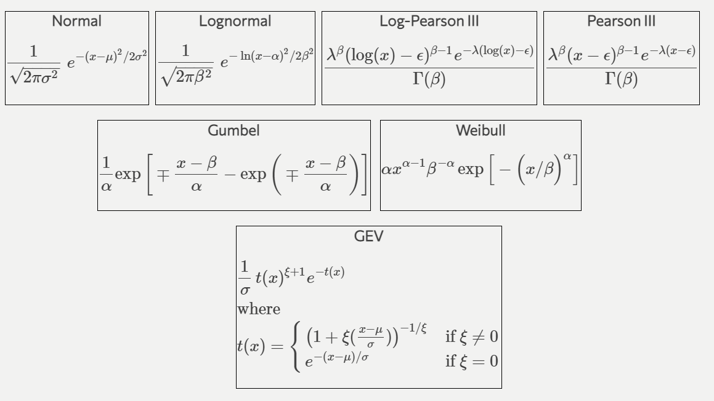

---

.panelset[
.panel[.panel-name[R Code]

```{r panel-chunk, fig.show='hide', eval=FALSE}
library(wildlandhydRo)

# Low outlier detection using MGMT
low_thresh <- MGBT::MGBT(peak_yaak$peak_va)

#get distributions
yaak_dist <- batch_distribution(peak_yaak, peak_va)

#get frequencies
yaak_ff <- batch_frequency(peak_yaak, peak_va)

#get goodness of fit tests
rep_dist <- reportDist(yaak_dist)

```
]

.panel[.panel-name[QQ Plot]

```{r, eval=FALSE}
plot_qqDist(yaak_dist)
```
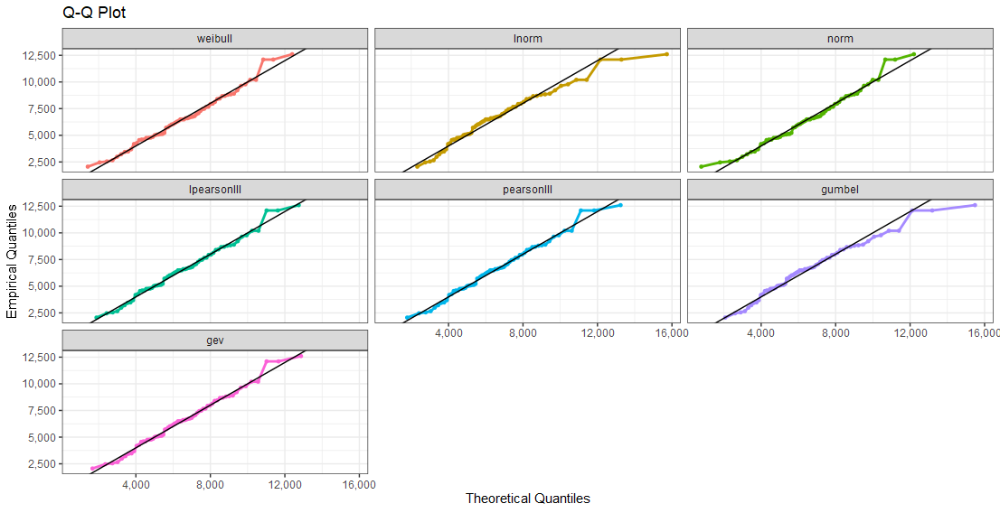
]

.panel[.panel-name[Frequency]

```{r, eval=FALSE}
ggplot(yaak_ff, aes(ReturnInterval, Value, color = Distribution)) + geom_point() + geom_line()
```
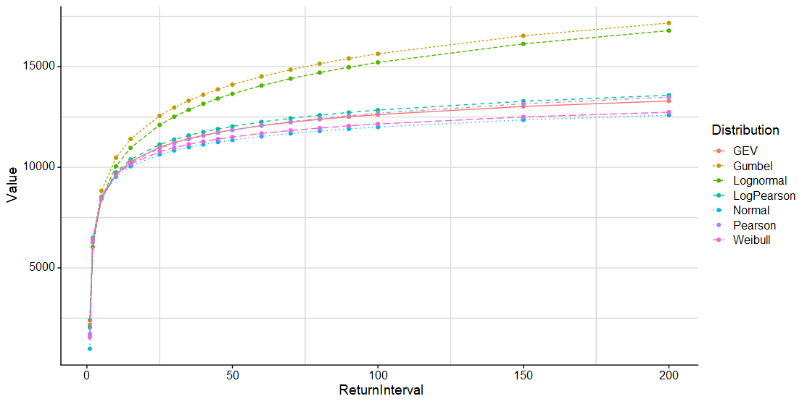
]

.panel[.panel-name[GOF]

```{r, eval=FALSE}
plot_reportDist(rep_dist)
```
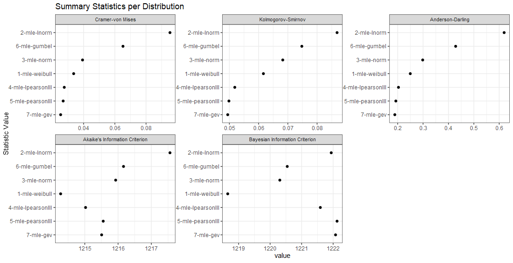
]
]

---

## Without Coding  

--

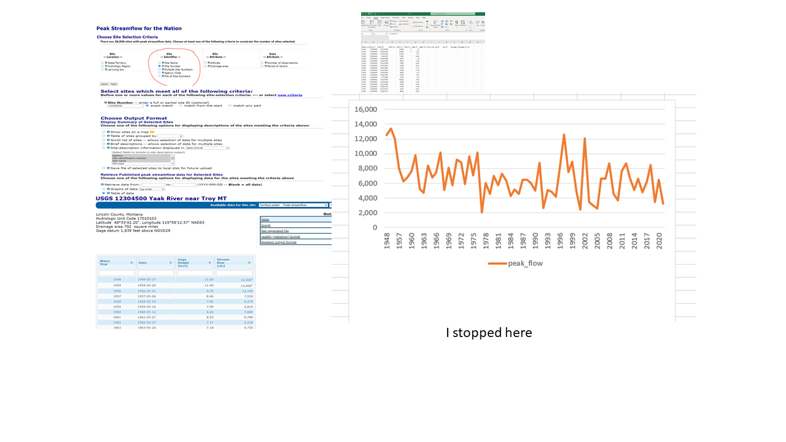

---

.center-black[Yes. It can be done.]
.center-text[I think so...]
---

.big-text-center[But what happens when we need to do this for 10, 20, 100 sites?]

---

.body-gif-bot[]

--

.big-text[It doesn't have to be like this!]
---

.big-text-center[This is where .blue[_scalability_] comes into play.]
---

.big-text-center[I like to explore USGS sites for stationarity and would like to see how HUC 17 looks.]

---

.big-gif-bot[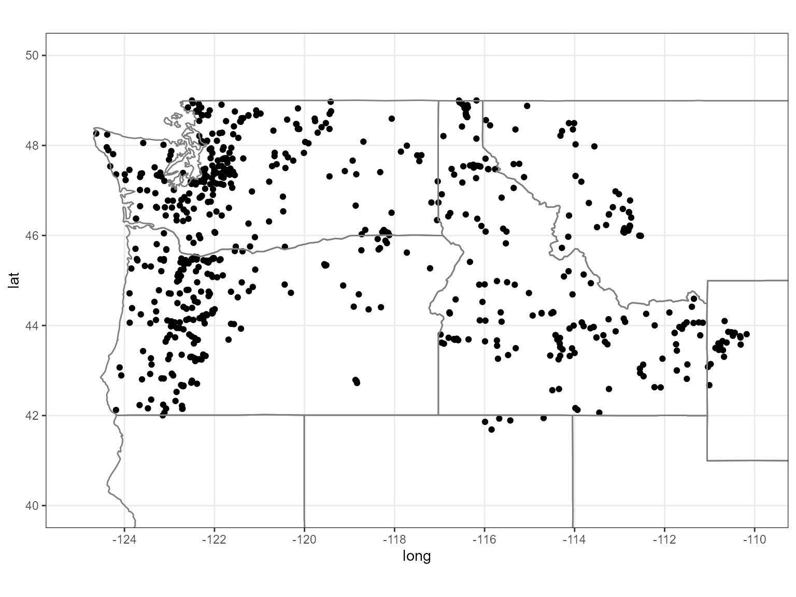]

---

.big-text-center[But, the method of clicking would take forever... 10 min/site for 675 = 11 days @ 10 hour days!!!!]

---

.big-text-center[With coding we can do that in a matter of minutes!]

---

By running in parallel we can get all the daily values for each site in about 11 minutes!
```{r eval = FALSE}
#need to call future::plan()

##### Remember, please use 10 or less workers #####
plan(multisession(workers = 11))

#running on 11 cores

system.time({
pnw_dv <- ww_dvUSGS(huc17_sites$site_no,
                    parameter_cd = '00060',
                    wy_month = 10,
                    parallel = TRUE,
                    verbose = FALSE)
})

#>    user  system elapsed 
#>   39.96    2.47  559.56

```

---
background-image: url('hydro_code_files/images/mk.png')
background-size: 90%

---

.big-text-center[Looks like there's some clustering?]


---

.big-text-center[Should we bring into .blue[ArcGIS]? Well, you can for sure. But, why not just
do it in the .blue[same environment?] ]

---

.center-black[Remember. .blue[One stop shop!]]


---

.big-text-center[Local Gi or Gi* (hot spot analysis).]  

---
<center>
<br>
<br>
<br>
<br>
.ff-big[
$G_i = \frac{\sum_j w_{ij} x_j}{\sum_j x_j}$
]
</center>
---

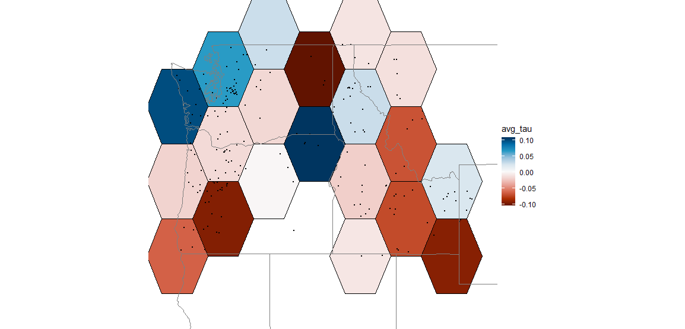


---

Now with the polygons and averages we can see if there are any 'hot spots'...

```{r, eval=F}
tau_hot_spots <- tau_lags |> 
  mutate(
    Gi = local_g_perm(tau_lag, nb, wt, nsim = 499)
  ) |> 
  unnest(Gi)
```


---

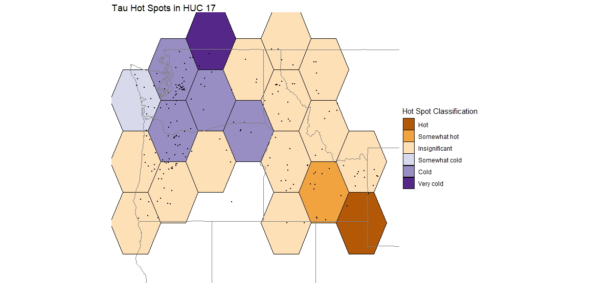

---

.big-text-center[This is great. But can I reproduce this in 1, 2, 5 years?]


---

.big-text[Sure. Why not?]

.body-gif-bottom[]


---

## Reproducibility  

--

.ff-mid[* Version Control
]

--

.ff-mid[* Documentation  
]
--

.ff-mid[* Environment/Dependencies
]
---

.big-text-center[Version control can help with maintaining your code and projects.]

---

.big-text-center[Github  and Git  are a few common ways to do this.]

---
<br>
<br>
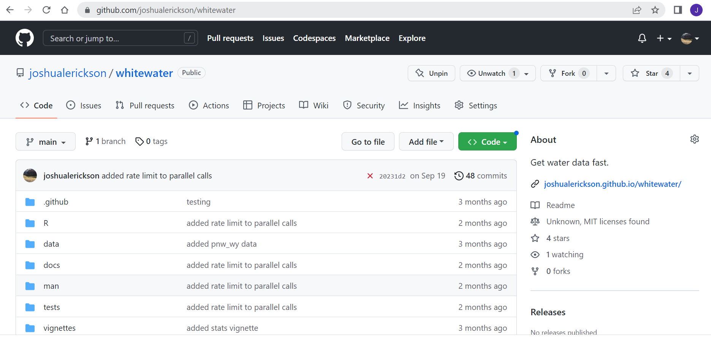

---

.big-text-center[Documentation will not only help others but will help .blue[future you!]]

---
<br>
.ff-mid[You can document functions]

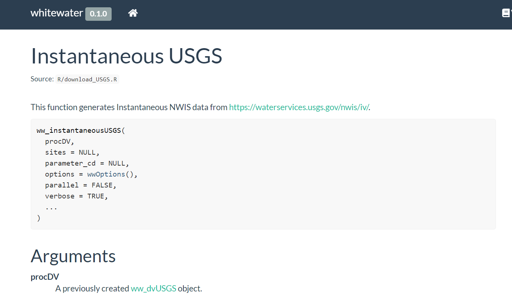

---

.big-text-center[There's so much you can do with documentation!!!!]

---

.big-text-center[Not going to go too deep... but Environment and dependencies will help you and others in the future as well!]

---

.big-text-center[Packages like {renv}  and conda  environments maintain the 'version' you used to run the code. (docker-ish)]

---
<br>
<br>
.big-text-center[This is great because we can then share without worrying too much about whether it will run or not! It's a nice way to gain trust...]

---
<br>
<br>
<br>
<br>


---

.big-text-center[Where to go? How?]


---
<center>
.ff-mid2[R for Data Science 
]


.ff-mid2[https://r4ds.had.co.nz/
]
</center>

---

<center>
.ff-mid2[Python for Data Science 
]


.ff-mid2[https://wesmckinney.com/book/
]
</center>

---

.big-text-center[I'd recommend starting with .blue[either]. If you want to build ArcGIS tools I'd recommend Python ]

---

.ff-mid2[For learning coding along side .blue[hydro] I'd recommend https://www.r4wrds.com/.]

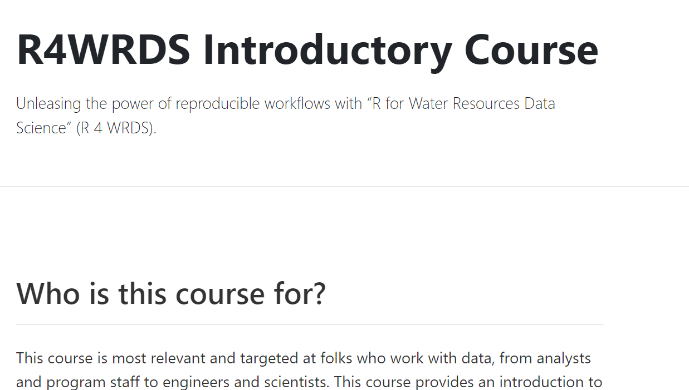

---

.ff-mid2[Other .blue[hydro] focused coding.]

* [nhdplusTools](https://github.com/USGS-R/nhdplusTools) 

* [dataRetrieval](https://github.com/DOI-USGS/dataRetrieval) 


* [pygeohydro](https://github.com/hyriver/pygeohydro) 


* [hyriver](https://docs.hyriver.io/) 


---
<center>

.ff-mid2[Where you'll do your coding.
]  

- Rstudio, VS Code, etc.  


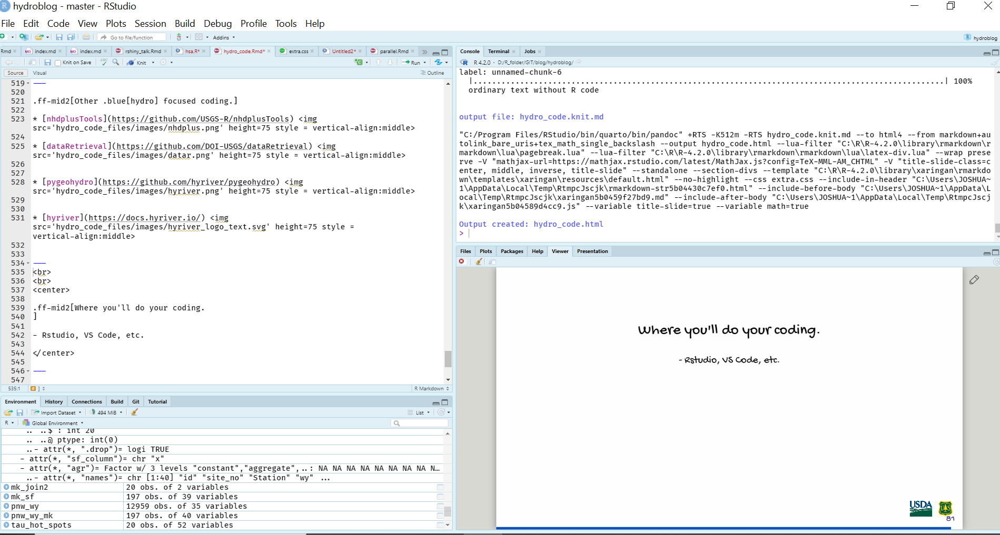  

</center>

---

.center-warning[But! We now have a Virtual Desktop (VDI)]

---
<center>
.ff-mid[
[VDI Data Center](https://usdagcc.sharepoint.com/sites/fs-eng-agisp/arcgispro/SitePages/Working%20in%20the%20Data%20Center.aspx)
]

</center>

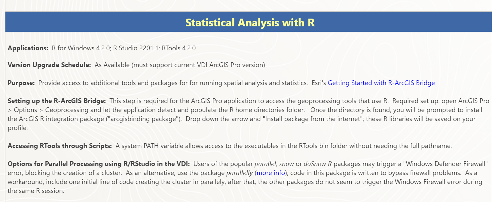

---

.ff-mid[I know it's a lot! So much to cover.]


---
<br>
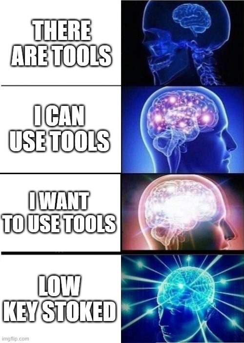

---

.big-text[I'm willing to help!]

<br>
<br>
<br>


---
<center>
.ff-mid[Thanks! 
]  

.ff-mid[Questions? 
]  

.ff-mid[Comments?
]

.ff-mid[Critiques? :)
]

</center>


