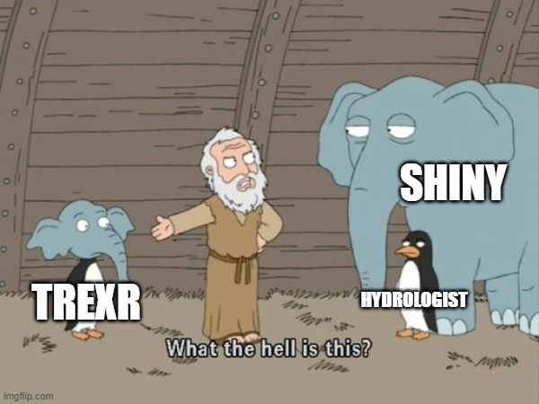
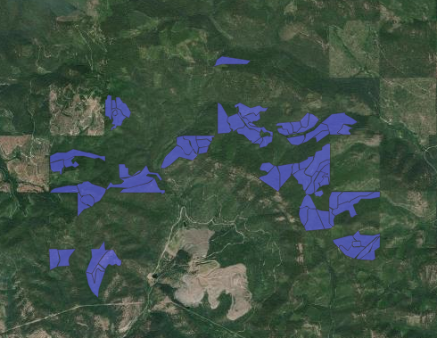
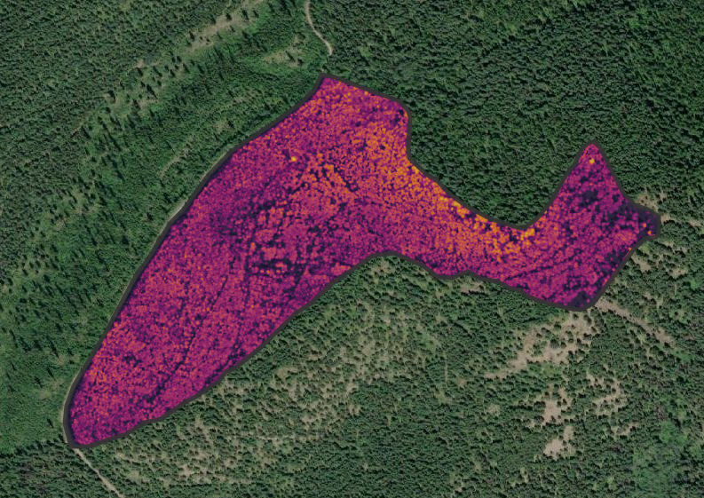
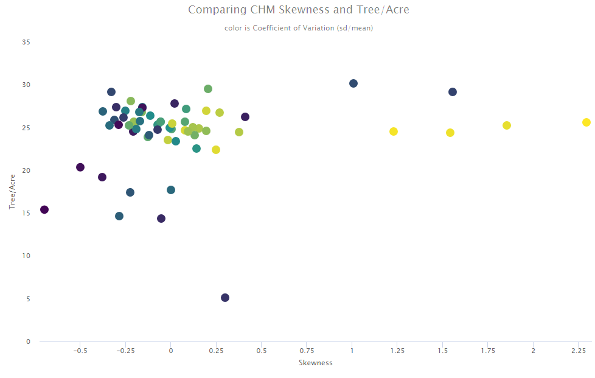
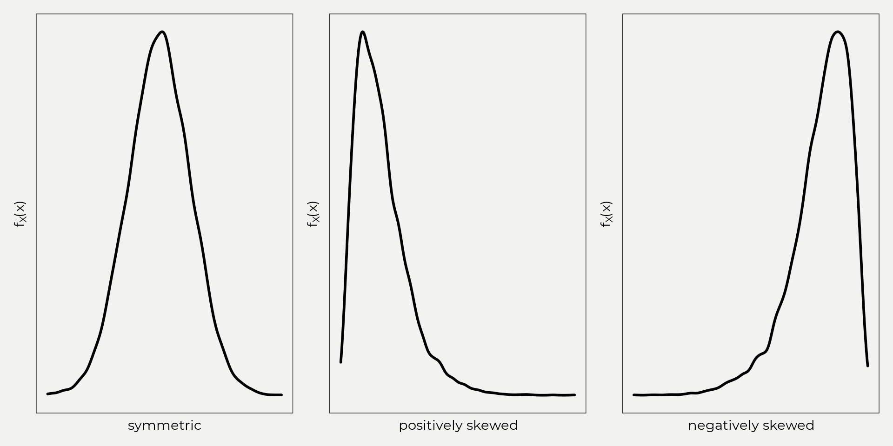
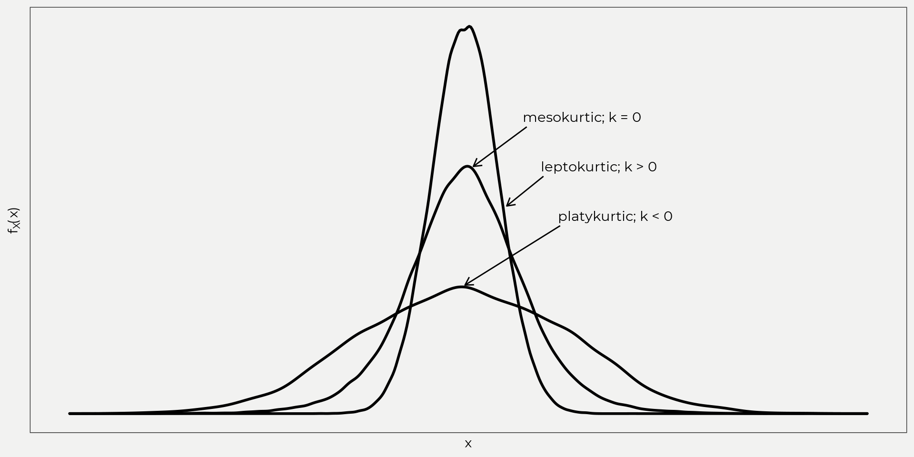
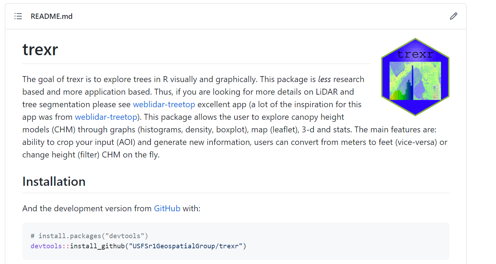

```{r setup, include=FALSE}
options(htmltools.dir.version = FALSE)
knitr::opts_chunk$set(
  fig.width=9, fig.height=3.5, fig.retina=3,
  out.width = "100%",
  cache = FALSE,
  echo = TRUE,
  message = FALSE, 
  warning = FALSE,
  fig.show = TRUE,
  hiline = TRUE
)
library(tidyverse)
library(highcharter)
```

```{r xaringan-themer, include=FALSE, warning=FALSE}
library(xaringanthemer)
style_mono_accent(
  base_color = "#035AA6",
  inverse_header_color = "#FFFFFF"
)
```

```{r xaringanExtra, echo=FALSE}
xaringanExtra::use_xaringan_extra(c("tile_view", "tachyons", "scribble", 'share_again'))
```
## About Me

- Hydrologist (day job); Kootenai National Forest

--

- Focus is leveraging computing platforms (R, Python, GEE) for resource management work.

--

- In my free time I like work on open source packages in R; [{tidyrgee}](https://github.com/r-tidy-remote-sensing/tidyrgee), [{gwavr}](https://github.com/joshualerickson/gwavr),
[{whitewater}](https://github.com/joshualerickson/whitewater)

.me-box[]
---

## Shout out  

--

Joe Fortier - Northern Region Geospatial Group  

.so-box[]

--

Sam Lammie - NRGG Program Manager  

--

[weblidar-treetop](https://github.com/carlos-alberto-silva/weblidar-treetop) - A lot of inspiration was built off of this!

---

## Outline
--

- Quick overview of the app.  

<center>
.trexr-box[]
</center>

--

- Go through a demo of the app.  

--

- Possible use case (toy example).  

---

## What is trexr?
--

- .blue[{trexr}] stands for Tree Exploration in R

--

- A free open source software .blue[(FOSS)] application (  ); essentially a tool...

--

- Provides users the ability to look at canopy height models (CHM) in a few different ways.  

--

  1. Descriptive Stats
  
--

  2. Graphs  

--

  3. Interactive Maps  

--

  4. 3-d Visualization  

--




- *Hopefully* a tool for natural resource practitioners to use!  

---

<center>

<h2>Advantages vs. Disadvantages</h2>

</center>

<center>
<br>
<a href="https://imgflip.com/i/6nrkk5"></a><div><a href="https://imgflip.com/memegenerator">from Imgflip Meme Generator</a></div>
</center>
---

## Advantages
--

- Great for winter time eda or time sensitive analysis  

--

- Crop images, different mapping layers, stats, etc.  

--

- Works well next to a GIS platform

--

- Really helps with planning and visualizing outliers.

--

## Disadvantages (IMO)

--

- Language specific (R)

--

- Not programmed asynchronously

--

- Not a GIS

---

<center>

<h1> DEMO </h1>

</center>
<center>
<br>
<a href="https://media.giphy.com/media/JAYf53yMO7cNa/giphy.gif"></a>
</center>

---

## Resource Applications  

- Explore some potential units for planning/recon, etc

--

- Good for winter time, safety reasons or quick eda  

---

## Flow  

- Bring in units  


--

- Extract CHM, stats, etc.  



--

- Visualise  


---

## Stats  

- Some things that I've found useful are skewness, kurtosis and coefficient of variation (cv).  

--


     
--



---

```{r, echo=FALSE, fig.height=8}
pa_trees_sf <- sf::read_sf('pa_trees.gpkg', layer = 'pa_trees') %>% mutate(coefficient_of_variation = round(coefficient_of_variation, 3))
mapview::mapview(pa_trees_sf, zcol = 'coefficient_of_variation',
                 map.types = 'Esri.WorldImagery',
                 alpha.regions = 0.55,
                 col.regions = hcl.colors(n = 55, 'Zissou1'))

# colors <- c(hcl.colors(n = 11, 'Zissou1'))
# pa_trees_sf$color <- highcharter::colorize(pa_trees_sf$coefficient_of_variation, colors)
# pa_trees_json <- pa_trees_sf %>% mutate(skewness = round(skewness, 3)) %>% geojsonsf::sf_geojson()
# 
# highchart(type = "map") %>%
#   hc_add_series(data = pa_trees_json,
#                 value = 'skewness',
#                 geojson = TRUE,
#                 name = 'Units',
#     tooltip = list(useHTML = TRUE,
#                    pointFormat = "Skewness: {point.properties.skewness} <br> ID : {point.properties.id}")) %>%
#   hc_colors(hcl.colors(n = 11, 'Zissou1'))
#   hc_colorAxis(
#     dataColor = "skewness",
#     minColor = hcl.colors(n = 11, 'Zissou1')[1],
#     maxColor = hcl.colors(n = 11, 'Zissou1')[11] 
#     ) %>% 
#   hc_title(text = "Example Units")

```


---

```{r, echo = F, message=F, warning=F, error=F, fig.height=8}

pa_trees_df <- read_csv('pa_trees_df.csv')
colors <- c(hcl.colors(n = 11, 'Zissou1'))
pa_trees_df <- pa_trees_df %>% filter(!is.na(coefficient_of_variation))
pa_trees_df$color <- highcharter::colorize(pa_trees_df$coefficient_of_variation, colors)
x <- c("Skewness", "Tree/Acre (over 30 ft)", "Coefficient of Variation", "ID")
y <- sprintf("{point.%s:.2f}", c("skewness", "tree_per_acre", "coefficient_of_variation", 'id'))

tltip <- tooltip_table(x, y)

hchart(pa_trees_df, "scatter",
       hcaes(x = skewness,
             y = tree_per_acre,
             color = color,
             label = coefficient_of_variation,
             label = id, value = coefficient_of_variation)) %>% 
hc_xAxis(
  title = list(text = "Skewness"),
  gridLineWidth = 0,
  reversed = F
) %>%
  hc_yAxis(
    title = list(text = "Tree/Acre"),
    gridLineWidth = 0
  ) %>%
  hc_title(
    style = list(color = hex_to_rgba("black", 0.5)),
    text = "Comparing CHM Skewness and Tree/Acre"
  ) %>%
  hc_subtitle(
    style = list(color = hex_to_rgba("black", 0.5)),
    text = "color is Coefficient of Variation (sd/mean)"
  ) %>% 
  hc_tooltip(
    useHTML = TRUE,
    headerFormat = "",
    pointFormat = tltip
  ) %>% 
  hc_plotOptions(
    scatter = list(
      marker = list(
        radius = 7
      )
    )
  )  


```

---

## How to get trexr  

- You can download the development version from github via [https://github.com/USFSr1GeospatialGroup/trexr](https://github.com/USFSr1GeospatialGroup/trexr)  

--




- Or you can use with citrix! Follow these awesome [tutorials](https://gcc02.safelinks.protection.outlook.com/?url=https%3A%2F%2Fusfs.box.com%2Fs%2Fbakdfthird2h8d31ei4ihb6ajihea510&data=05%7C01%7C%7C2d27cb9e15e94e54e05f08da6f0c3c3a%7Ced5b36e701ee4ebc867ee03cfa0d4697%7C0%7C0%7C637944395583986952%7CUnknown%7CTWFpbGZsb3d8eyJWIjoiMC4wLjAwMDAiLCJQIjoiV2luMzIiLCJBTiI6Ik1haWwiLCJXVCI6Mn0%3D%7C3000%7C%7C%7C&sdata=C%2B4%2FU3xMvtjvRmyHdJW6WAcYf4R71sxIpKFPotJTN4Q%3D&reserved=0) by Joe Fortier to get you going!  

--

- Documentation from NRGG coming soon.  

---

## The End  


